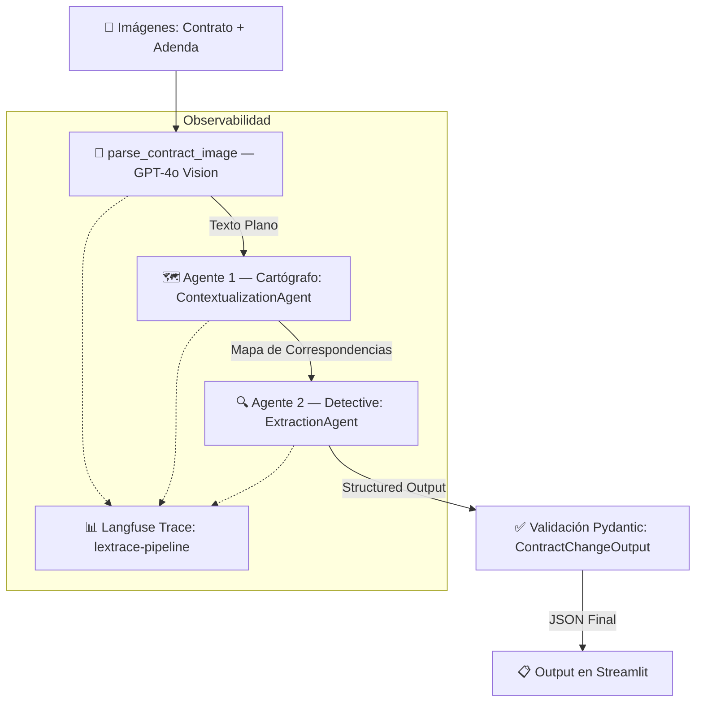

# ⚖️ LexTrace — Multi-Agent Contract Analysis System


Sistema multi-agente que analiza diferencias entre un contrato original y su adenda/enmienda. Extrae texto de imágenes escaneadas mediante GPT-4o Vision, identifica cambios legales a través de dos agentes especializados y produce un JSON estructurado validado con Pydantic v2.

---

## 🏗️ Arquitectura



### Pipeline Multi-Agente

| Paso | Componente                | Rol              | Input → Output                         |
| ---- | ------------------------- | ---------------- | -------------------------------------- |
| 1    | `parse_contract_image`    | Extracción OCR   | Imagen → Texto plano                   |
| 2    | `ContextualizationAgent`  | 🗺️ Cartógrafo    | 2 textos → `list[SectionMapping]`      |
| 3    | `ExtractionAgent`         | 🔍 Detective     | Mappings → `ContractChangeOutput`      |
| 4    | Pydantic Validation       | Validación       | Structured Output → JSON validado      |

---

## 🧠 Decisiones de Arquitectura

### ¿Por qué 2 agentes en vez de 1 prompt?

Un solo prompt que reciba ambos contratos completos sufre de **degradación de contexto**: al intentar alinear secciones Y detectar cambios simultáneamente, la calidad de ambas tareas disminuye. La separación de responsabilidades resuelve esto:

- **Cartógrafo** 🗺️: Se enfoca exclusivamente en el alineamiento semántico entre secciones. Su output es un mapa de correspondencias limpio que reduce el ruido para el siguiente agente.
- **Detective** 🔍: Recibe un contexto altamente enfocado (pares de secciones ya alineadas), lo que minimiza drásticamente las alucinaciones en la extracción de cambios legales.

### ¿Por qué `with_structured_output` y no `model_validate()`?

Ambos enfoques son válidos según la consigna. Se eligió `with_structured_output()` de LangChain porque:

1. **Fuerza el schema a nivel de API**: OpenAI genera la respuesta ya en el formato correcto, reduciendo errores de parsing.
2. **Integración nativa con LangChain**: El objeto Pydantic se retorna directamente, sin pasos intermedios de deserialización.
3. **Compatibilidad con Langfuse**: Los callbacks capturan automáticamente el structured output como parte del trace.

### ¿Por qué `temperature=0`?

En el dominio legal, la reproducibilidad es crítica. Un análisis de contrato debe producir resultados consistentes ante las mismas entradas. `temperature=0` garantiza outputs determinísticos.

### Observabilidad con Langfuse

La integración con Langfuse utiliza `propagate_attributes()` para crear una **traza padre** (`lextrace-pipeline`) con jerarquía de spans. Esto permite:

- Auditar cada decisión de los agentes paso a paso
- Controlar costos por token en cada etapa
- Medir latencia por agente
- Registrar metadata contextual (cantidad de caracteres procesados, interfaz de origen)

---

## 📁 Estructura del Proyecto

```
lextrace/
├── .env.example          # Variables de entorno requeridas
├── requirements.txt      # Dependencias Python
├── README.md
├── app.py                # Interfaz Streamlit + orquestación del pipeline
├── data/
│   └── test_contracts/   # Imágenes de contratos de prueba
└── src/
    ├── main.py            # Orquestador CLI (modo terminal)
    ├── models.py          # Modelos Pydantic v2
    ├── agents/
    │   ├── __init__.py
    │   ├── contextualizer.py  # Agente 1 — Cartógrafo
    │   └── extractor.py       # Agente 2 — Detective
    └── utils/
        └── image_processor.py # GPT-4o Vision utilities
```

---

## 🚀 Instalación

### 1. Clonar y crear entorno virtual

```bash
git clone <repo-url>
cd lextrace
python -m venv .venv

# Windows
.venv\Scripts\activate

# macOS/Linux
source .venv/bin/activate
```

### 2. Instalar dependencias

```bash
pip install -r requirements.txt
```

### 3. Configurar variables de entorno

```bash
cp .env.example .env
# Editar .env con tus API keys
```

Variables requeridas:

| Variable              | Descripción                                   |
| --------------------- | --------------------------------------------- |
| `OPENAI_API_KEY`      | API key de OpenAI para GPT-4o Vision          |
| `LANGFUSE_SECRET_KEY` | Secret key de Langfuse                        |
| `LANGFUSE_PUBLIC_KEY` | Public key de Langfuse                        |
| `LANGFUSE_HOST`       | URL del host de Langfuse (default: `https://us.cloud.langfuse.com`) |

---

## 📖 Uso

### Interfaz Web (Streamlit)

```bash
streamlit run app.py
```

La interfaz permite:

- **Cargar imágenes** de contratos escaneados (PNG, JPG, JPEG, WEBP) — hasta 3 hojas por documento.
- **Extraer texto** de cada hoja con GPT-4o Vision (OCR).
- **Editar manualmente** el texto extraído antes del análisis.
- **Ejecutar el pipeline** de análisis comparativo con un click.
- **Visualizar resultados** estructurados: resumen, temas involucrados y secciones modificadas.

Las API keys se configuran en el sidebar y se mantienen en memoria de sesión — no se persisten en disco.

### Modo CLI (Terminal)

```bash
python src/main.py data/original.png data/amendment.png
```

### Ejemplo de Output

```json
{
  "sections_changed": [
    "1. Alcance del Servicio",
    "2. Duración",
    "3. Honorarios",
    "4. Entregables",
    "7. Propiedad Intelectual"
  ],
  "topics_touched": [
    "Alcance del Servicio",
    "Plazos",
    "Financiero",
    "Entregables",
    "Propiedad Intelectual"
  ],
  "summary_of_the_change": "Se amplió el alcance del servicio para incluir análisis regulatorio. La duración del servicio se extendió de 6 a 9 meses. El honorario mensual aumentó de USD 8.000 a USD 9.500. La frecuencia de los reportes de avance cambió de mensual a quincenal. Se añadió una nueva cláusula de propiedad intelectual, estableciendo que todos los entregables serán propiedad del Cliente tras el pago final."
}
```

---

## 📊 Observabilidad (Langfuse)

Cada ejecución del pipeline genera una traza `lextrace-pipeline` en Langfuse con jerarquía de spans:

```
lextrace-pipeline (traza padre)
├── ContextualizationAgent → ChatOpenAI (span — Cartógrafo)
└── ExtractionAgent → ChatOpenAI (span — Detective)
```

Cada span registra automáticamente:

- **Model name** y **temperature** de cada llamada
- **Usage tokens** (prompt + completion)
- **Costo estimado** por llamada
- **Latencia** de cada paso
- **Metadata contextual**: caracteres procesados, interfaz de origen

Para ver los traces, accedé a tu [dashboard de Langfuse](https://us.cloud.langfuse.com) y buscá la traza `lextrace-pipeline`.

---

## 🛡️ Manejo de Errores

El sistema implementa manejo específico de errores con mensajes claros para el usuario:

| Error                  | Causa                                        | Mensaje al usuario                                    |
| ---------------------- | -------------------------------------------- | ----------------------------------------------------- |
| `ValidationError`      | El LLM generó un formato incompatible        | "El modelo generó un formato incompatible con el schema esperado" |
| `RateLimitError`       | Se superó el límite de requests de OpenAI     | "Se alcanzó el límite de la API. Esperá un momento"  |
| `APITimeoutError`      | Timeout en la conexión con OpenAI            | "La conexión con OpenAI expiró. Reintentá"           |
| `RuntimeError`         | Fallo en la extracción OCR de imagen         | Detalle del error original                            |

---

## 🧪 Verificación

### Tests rápidos de imports y modelos

```bash
# Verificar imports y estructura
python -c "from src.models import ContractChangeOutput; from src.agents.contextualizer import ContextualizationAgent; from src.agents.extractor import ExtractionAgent; from src.utils.image_processor import encode_image_to_base64; print('Todos los modulos importan correctamente.')"

# Verificar validación Pydantic
python -c "from src.models import ContractChangeOutput; o = ContractChangeOutput(sections_changed=['Clausula 4'], topics_touched=['Honorarios'], summary_of_the_change='Aumento de precio'); print(o.model_dump_json(indent=2))"
```

---

## 📄 Licencia

MIT