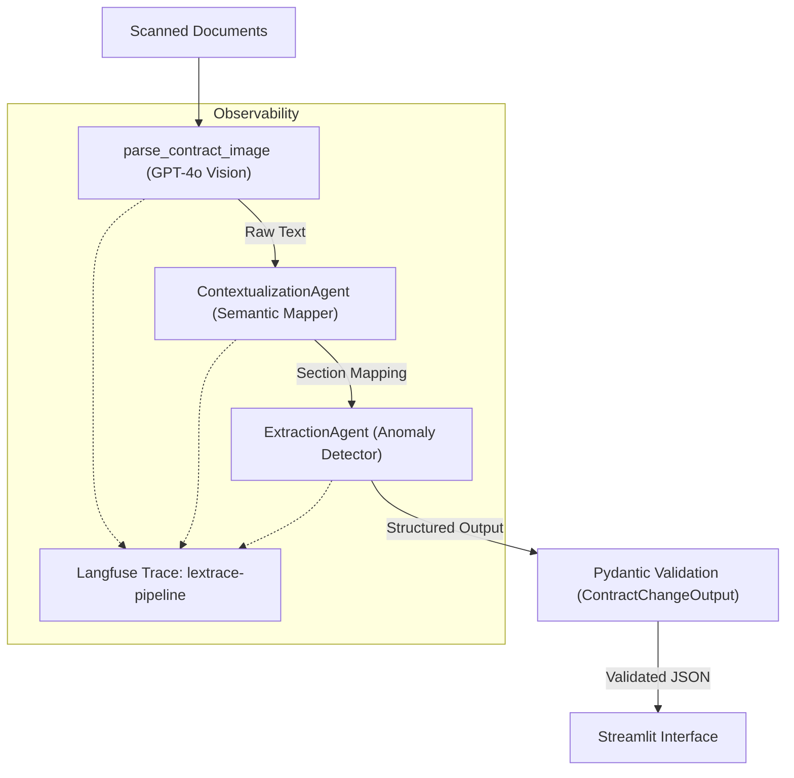

# LexTrace: Multi-Agent Semantic Contract Analysis System


An enterprise-grade multi-agent system designed to analyze semantic discrepancies between an original contract and its amendments. The pipeline extracts text from scanned images using GPT-4o Vision, identifies legal modifications through specialized agents, and outputs a structured JSON validated with Pydantic v2.

---

## Architecture Overview



### Multi-Agent Pipeline

| Step | Component                | Role               | Input → Output                     |
|------|--------------------------|--------------------|------------------------------------|
| 1    | `parse_contract_image`   | OCR Extraction     | Image → Raw Text                   |
| 2    | `ContextualizationAgent` | Semantic Mapper    | 2 Texts → `list[SectionMapping]`   |
| 3    | `ExtractionAgent`        | Anomaly Detector   | Mappings → `ContractChangeOutput`  |
| 4    | Pydantic Validation      | Schema Enforcement | Structured Output → Validated JSON |

---

## Engineering Decisions

### Mitigating LLM Context Fatigue

A single-prompt approach receiving full contracts suffers from context degradation: attempting to align sections AND detect semantic changes simultaneously degrades the quality of both tasks. Separation of concerns resolves this:

- **Contextualization Agent:** Focuses exclusively on semantic alignment between sections. Its output is a clean mapping that acts as a noise-reduction filter.
- **Extraction Agent:** Receives a highly focused context window (pre-aligned section pairs), drastically minimizing hallucinations during legal anomaly detection.

### Structured Outputs API over Native Parsing

While standard `model_validate()` is functional, LangChain's `with_structured_output()` was implemented because:

1. **API-Level Schema Enforcement:** Forces the LLM to generate the response in the exact schema natively, reducing parsing overhead.
2. **Seamless Integration:** Returns the Pydantic object directly without intermediate deserialization steps.
3. **Observability Sync:** Langfuse callbacks automatically capture the structured output as part of the execution trace.

### Deterministic Execution (`temperature=0`)

In the legal domain, reproducibility is critical. A contract analysis must yield consistent results across identical inputs. Setting `temperature=0` ensures deterministic agent behavior.

### Enterprise Observability with Langfuse

Integration utilizes `propagate_attributes()` to generate a parent trace (`lextrace-pipeline`) with a span hierarchy. This infrastructure provides:

- Step-by-step auditing of agent decisions.
- Token cost tracking per execution stage.
- Latency monitoring per agent.
- Contextual metadata logging (processed character counts, origin interface).

---

## Project Structure

```text
lextrace/
├── .env.example              # Environment variables template
├── requirements.txt          # Python dependencies
├── README.md
├── app.py                    # Streamlit interface & pipeline orchestration
├── data/
│   └── test_contracts/       # Sample contract images
└── src/
    ├── main.py               # CLI orchestrator
    ├── models.py             # Pydantic v2 schemas
    ├── agents/
    │   ├── __init__.py
    │   ├── contextualizer.py # ContextualizationAgent (Semantic Mapper)
    │   └── extractor.py      # ExtractionAgent (Anomaly Detector)
    └── utils/
        └── image_processor.py # GPT-4o Vision utilities
```

---

## Installation & Setup

### 1. Clone and Initialize Environment

```bash
git clone <repo-url>
cd lextrace
python -m venv .venv

# Windows
.venv\Scripts\activate

# macOS/Linux
source .venv/bin/activate
```

### 2. Install Dependencies

```bash
pip install -r requirements.txt
```

### 3. Configure Environment Variables

```bash
cp .env.example .env
```

Required keys:

| Variable              | Description                                                   |
|-----------------------|---------------------------------------------------------------|
| `OPENAI_API_KEY`      | OpenAI API key for GPT-4o Vision & agent execution           |
| `LANGFUSE_SECRET_KEY` | Langfuse Secret Key                                           |
| `LANGFUSE_PUBLIC_KEY` | Langfuse Public Key                                           |
| `LANGFUSE_HOST`       | Langfuse Host URL (default: `https://us.cloud.langfuse.com`) |

---

## Usage

### Web Interface (Streamlit)

```bash
streamlit run app.py
```

Features include:

- **Image Upload:** Supports PNG, JPG, JPEG, WEBP (up to 3 pages per document).
- **Vision Extraction:** OCR processing via GPT-4o Vision.
- **Manual Override:** Text editing capabilities prior to agent analysis.
- **Execution:** One-click comparative analysis pipeline.
- **Data Visualization:** Structured rendering of summaries, topics, and modified sections.

*Note: API keys are configured via the sidebar and held in session state; they are not persisted to disk.*

### CLI Mode

The `src/main.py` entry point executes the complete pipeline via terminal, requiring two image paths as positional arguments:

```bash
python -m src.main <path_original_contract> <path_amendment>
```

#### Execution Log

```text
LexTrace -- Starting analysis...

[Step 1] Extracting text from images...
   -> Processing original contract: data/test_contracts/original.png
   [OK] Original: 798 characters extracted
   -> Processing amendment: data/test_contracts/amendment.png
   [OK] Amendment: 1011 characters extracted

[Step 2] Semantic Mapper Agent -- Mapping section correspondences...
   [OK] 7 sections mapped
      [MOD] 1. Scope of Service
      [MOD] 2. Duration
      [MOD] 3. Fees
      [MOD] 4. Deliverables
      [MOD] 5. Confidentiality
      [MOD] 6. Governing Law
      [NEW] 7. Intellectual Property

[Step 3] Anomaly Detector Agent -- Analyzing changes...
   [OK] Analysis complete

============================================================
FINAL RESULT
============================================================
```

#### Output (JSON)

```json
{
  "sections_changed": [
    "1. Scope of Service",
    "2. Duration",
    "3. Fees",
    "4. Deliverables",
    "7. Intellectual Property"
  ],
  "topics_touched": [
    "Technical Support",
    "Deadlines",
    "Financial",
    "Intellectual Property"
  ],
  "summary_of_the_change": "The scope of service was expanded to include regulatory analysis. The contract duration was extended from 6 to 9 months. The monthly fee increased from USD 8,000 to USD 9,500. Progress report frequency changed from monthly to biweekly. An intellectual property clause was added establishing that all deliverables become the property of the Client upon final payment."
}
```

---

## Observability

Each pipeline execution generates a `lextrace-pipeline` trace in Langfuse with a span hierarchy:

```text
lextrace-pipeline (parent trace)
├── ContextualizationAgent → ChatOpenAI (span — Semantic Mapper)
└── ExtractionAgent → ChatOpenAI (span — Anomaly Detector)
```

Each span automatically records:

- Model name and temperature per call.
- Token usage (prompt + completion).
- Estimated cost per call.
- Latency per step.
- Contextual metadata: characters processed, origin interface.

Traces are accessible via the [Langfuse dashboard](https://us.cloud.langfuse.com) under the `lextrace-pipeline` trace name.

---

## Error Handling

| Exception         | Root Cause                                 | Resolution / Feedback                       |
|-------------------|--------------------------------------------|---------------------------------------------|
| `ValidationError` | LLM generated a schema-incompatible format | Schema mismatch logged; retry requested.    |
| `RateLimitError`  | OpenAI request limit exceeded              | Rate limit reached. Execution paused.       |
| `APITimeoutError` | OpenAI connection timeout                  | Connection expired. Retry execution.        |
| `RuntimeError`    | OCR image extraction failure               | Exposes original error details for debugging.|

---

## License

MIT